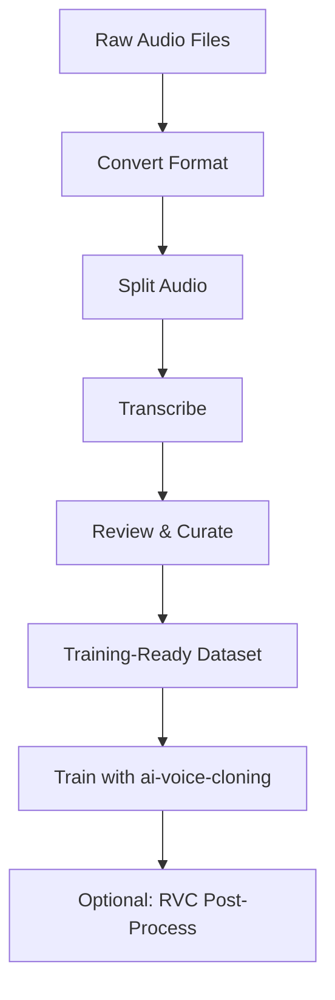

# 🎙️ Audio Dataset Manager

> An all-in-one tool for preparing audiobooks and large audio files for TTS training and voice cloning

[](https://github.com/maepopi/Audio_Dataset_Manager/stargazers)
[](https://github.com/maepopi/Audio_Dataset_Manager/network/members)
[](https://opensource.org/licenses/MIT)
[](https://www.python.org/downloads/)

---

## 📖 Table of Contents

- [Overview](#-overview)
- [Features](#-features)
- [Results Showcase](#-results-showcase)
- [Installation](#-installation)
- [Usage Guide](#-usage-guide)
- [Workflow](#-workflow)
- [Roadmap](#-roadmap)
- [Acknowledgments](#-acknowledgments)
- [License](#-license)

---

## 🎯 Overview

Audio Dataset Manager is a comprehensive toolkit designed to streamline the preparation of audio datasets for TTS (Text-to-Speech) training and voice cloning projects. 

Born from the need to efficiently process dozens of hours of audiobook data for voice cloning projects, this tool bridges the gap between raw audio files and training-ready datasets for tools like [ai-voice-cloning](https://git.ecker.tech/mrq/ai-voice-cloning) and [Tortoise-TTS](https://github.com/neonbjb/tortoise-tts).

**📹 Quick Tutorial:** [Watch on YouTube](https://www.youtube.com/watch?v=1MVc2B4nwk8) (5 minutes)

### What This Tool Does

✅ Prepares datasets **prior to training**  
❌ Does NOT provide training or fine-tuning features

For actual training, use this tool in combination with:
- [MRQ's ai-voice-cloning](https://git.ecker.tech/mrq/ai-voice-cloning) or [Jarod's fork](https://github.com/JarodMica/ai-voice-cloning)
- [Retrieval-based Voice Conversion (RVC)](https://github.com/RVC-Project/Retrieval-based-Voice-Conversion-WebUI)

---

## ✨ Features

- 🎵 **Audio Analysis** - Analyze silence patterns to optimize splitting
- 🔄 **Format Conversion** - Convert between MP3/WAV formats
- ✂️ **Intelligent Splitting** - Split long audio files into training-ready clips (0.6-11s)
- 🤖 **Auto-Transcription** - Powered by OpenAI Whisper (multiple model sizes)
- 🔍 **Dataset Review** - Interactive UI to review, correct, and curate your dataset
- 📝 **JSON Management** - Automatic backup and versioning of transcription files
- 🗑️ **Smart Deletion** - Safely remove clips with automatic archival
- 🔢 **Auto-Reindexing** - Keep your dataset files sequentially organized

---

## 🎨 Results Showcase

Real-world example: Cloning Regis from The Witcher 3 (voiced by Mark Noble)

### Original Game Audio
https://github.com/maepopi/audio-dataset-manager/assets/35258413/2fb73eb7-bed9-4ec0-9863-132e1a587556

### Generated with Tortoise Base Model
https://github.com/maepopi/audio-dataset-manager/assets/35258413/24012f9c-c18e-40ce-bca7-d394bd88b6ec

### Generated with Fine-tuned Model
https://github.com/maepopi/audio-dataset-manager/assets/35258413/cd40b8cf-1be4-4340-a26f-d8d1a3b8e656

### Fine-tuned Model + RVC Post-Processing
https://github.com/maepopi/audio-dataset-manager/assets/35258413/0950b78f-2713-4e0a-a1f9-3b6cfdc9502a

> 💡 **Tip:** Combining fine-tuned Tortoise with RVC produces the best results. Check out [Jarod Mica's RVC tutorial](https://www.youtube.com/watch?v=7tpWH8_S8es&t=615s).

---

## 🔧 Installation

### Prerequisites

- Python 3.9+
- FFmpeg
- Conda (recommended)

### Linux Installation

#### 1. Create Conda Environment

```bash
conda create --name audio-dataset-manager python=3.9
conda activate audio-dataset-manager
```

#### 2. Clone Repository

```bash
git clone https://github.com/maepopi/Audio_Dataset_Manager.git
cd Audio_Dataset_Manager
```

#### 3. Install Dependencies

```bash
pip install -r requirements.txt
sudo apt install ffmpeg
```

#### 4. Launch

```bash
python webui_main.py
# or
python3 webui_main.py
```

---

### Windows Installation

> ⚠️ **Recommendation:** Use WSL for best compatibility. Native Windows support is experimental.

#### 1. Install Prerequisites

- Download and install [Anaconda](https://www.anaconda.com/download)
- Install FFmpeg and add to PATH ([Tutorial](https://www.youtube.com/watch?v=jZLqNocSQDM))

#### 2. Create Environment

```bash
conda create --name audio-dataset-manager python=3.9
conda activate audio-dataset-manager
```

#### 3. Clone & Install

```bash
git clone https://github.com/maepopi/Audio_Dataset_Manager.git
cd Audio_Dataset_Manager
pip install -r requirements.txt
```

#### 4. Troubleshooting

If you encounter package conflicts, manually install:

```bash
pip install gradio
pip install openai-whisper
```

#### 5. Launch

```bash
python webui_main.py
```

---

## 🖥️ Usage Guide

### Tab 1: 🪄 Sound Analysis and Conversion

#### Audio Analysis (In Development)

Analyze silence patterns in your audio files to determine optimal splitting thresholds:
- Minimum silence duration
- Average silence duration
- Maximum silence duration

This helps you define the threshold for the audio splitting feature.

#### Audio Conversion

Convert audio files between formats for processing.

**Inputs:**
- **Input Folder:** Path to folder containing audio files
- **Output Folder:** Destination path for converted files
- **Export Format:** Choose MP3 or WAV

---

### Tab 2: ✂️ Split Audio

Split long audio files into training-ready clips (0.6-11 seconds).

#### How It Works

The splitter uses intelligent silence detection to avoid cutting mid-word:

**Example:**
```
Original: "I went to the bar, and ordered a drink. [0.8s silence] The barman smiled."
```

**Result:**
```
Clip 1: "I went to the bar, and ordered a drink. [0.4s]"
Clip 2: "[0.4s] The barman smiled."
```

#### Parameters

- **Input Folder:** Path to audio files to split
- **Silence Duration:** Minimum silence duration to trigger split (in seconds)
- **Output Folder:** Destination for split clips
- **Use Transcription in Names:** ✅ Include transcription snippets in filenames
- **Whisper Model:** Choose transcription model (larger = more accurate, slower)

#### Advanced: Recursive Splitting

If segments exceed 11 seconds after initial split:
1. Silence threshold is halved
2. New silences are detected and processed
3. Repeats until all clips are under 11 seconds

Clips that cannot be split are moved to a `Non Usable` folder for manual processing.

#### Reindexing

Keep your files sequentially numbered after cleanup:

**Before:**
```
Audio001.wav
Audio002.wav
Audio004.wav  # Audio003 was deleted
```

**After Reindex:**
```
Audio001.wav
Audio002.wav
Audio003.wav  # Sequential again
```

---

### Tab 3: 💬 Transcribe Audio

Two transcription methods available:

#### Option 1: Internal Transcription

Use Audio Dataset Manager's built-in Whisper integration.

**Settings:**
- Input folder path
- Whisper model size
- Output folder for JSON

#### Option 2: MRQ ai-voice-cloning

Use MRQ's tool for transcription:

1. Clone [MRQ ai-voice-cloning](https://git.ecker.tech/mrq/ai-voice-cloning)
2. Place audio files in `voices/your-folder`
3. Launch interface (`start.bat` or `start.sh`)
4. Navigate to Training tab → Transcribe and Process
5. Find generated `whisper.json` in `training/` folder
6. Use this JSON in the next tab

---

### Tab 4: 👀 Check JSON and Audios

**The most important tab** - review, correct, and curate your dataset.

#### Required Structure

```
📁 dataset/
├── 📁 audios/
│   ├── clip001.wav
│   ├── clip002.wav
│   └── ...
└── 📄 whisper.json
```

#### Workflow

1. **Load Data:** Point to your folder structure
   - Automatic JSON backup created (`backup_whisper.json`)

2. **Navigate:** Use Previous/Next or jump to specific page

3. **Review Audio:** Listen to each clip

4. **Edit Transcription:**
   - Correct **JSON Reference** (full transcription)
   - Correct corresponding **Segments** (timestamped chunks)
   - Adjust **start/end** timecodes if needed

5. **Save Changes:** ⚠️ **CRITICAL** - Click "Save JSON" before changing pages!

#### Delete from Dataset

**Single Deletion:**
- Click "Delete from Dataset"
- Audio moved to `Discarded Audios/` folder
- Entry saved to `discarded_entries.json`

**Batch Deletion:**
- Enter start audio index (e.g., `1` for `audio_000001`)
- Enter end audio index (e.g., `12` for `audio_000012`)
- All clips in range are deleted

> 💡 **Recovery:** Deleted items can be restored from backup folders

---

## 🔄 Workflow



### Recommended Pipeline

1. **Convert** audio to consistent format (WAV recommended)
2. **Analyze** silence patterns (optional)
3. **Split** into clips using optimal threshold
4. **Transcribe** with Whisper
5. **Review** each clip and fix transcription errors
6. **Reindex** for clean sequential numbering
7. **Export** to training tool

---

## 🗺️ Roadmap

- [ ] Automatic silence threshold analysis
- [ ] Train/validation dataset split manager
- [ ] Batch processing improvements
- [ ] Docker containerization
- [ ] Support for additional audio formats (FLAC, OGG)
- [ ] GPU acceleration for Whisper transcription
- [ ] Real-time audio preview during editing
- [ ] Export statistics and quality metrics

---

## 🙏 Acknowledgments

This tool was built to complement the excellent work of:

- **[neonbjb](https://github.com/neonbjb)** - Creator of Tortoise-TTS
- **[mrq](https://git.ecker.tech/mrq)** - ai-voice-cloning tool
- **[JarodMica](https://github.com/JarodMica)** - Enhanced ai-voice-cloning fork
- **OpenAI** - Whisper transcription model
- **RVC Project** - Retrieval-based Voice Conversion

Special thanks to the voice cloning community for inspiration and feedback.

---

## 🤝 Contributing

Contributions are welcome! Whether it's:

- 🐛 Bug reports
- 💡 Feature suggestions
- 📝 Documentation improvements
- 🔧 Code contributions

Please open an issue or submit a PR on [GitHub](https://github.com/maepopi/Audio_Dataset_Manager).

---

## 📝 License

This project is [MIT](LICENSE) licensed.

---

## 🔗 Related Tools & Resources

This tool is designed to work alongside these excellent projects:

### Training & Voice Cloning
- **[Tortoise-TTS](https://github.com/neonbjb/tortoise-tts)** - High-quality text-to-speech synthesis
- **[ai-voice-cloning (MRQ)](https://git.ecker.tech/mrq/ai-voice-cloning)** - Fine-tuning tool for Tortoise
- **[ai-voice-cloning (Jarod's Fork)](https://github.com/JarodMica/ai-voice-cloning)** - Enhanced version with additional features

### Voice Conversion
- **[RVC (Retrieval-based Voice Conversion)](https://github.com/RVC-Project/Retrieval-based-Voice-Conversion-WebUI)** - Post-processing for enhanced quality
- **[RVC Tutorial by Jarod Mica](https://www.youtube.com/watch?v=7tpWH8_S8es&t=615s)** - Comprehensive guide

### Transcription
- **[OpenAI Whisper](https://github.com/openai/whisper)** - Automatic speech recognition (used internally)

---

## 💬 Support & Community

- 🐛 [Report an issue](https://github.com/maepopi/Audio_Dataset_Manager/issues)
- 💡 [Request a feature](https://github.com/maepopi/Audio_Dataset_Manager/issues)
- ⭐ [Star this repo](https://github.com/maepopi/Audio_Dataset_Manager) if it helps you!
- 📺 [Tutorial video](https://www.youtube.com/watch?v=1MVc2B4nwk8)

---

<div align="center">
Made with ❤️ for the voice cloning community
<br><br>
<sub>README documentation written with assistance from Claude AI</sub>
</div>
